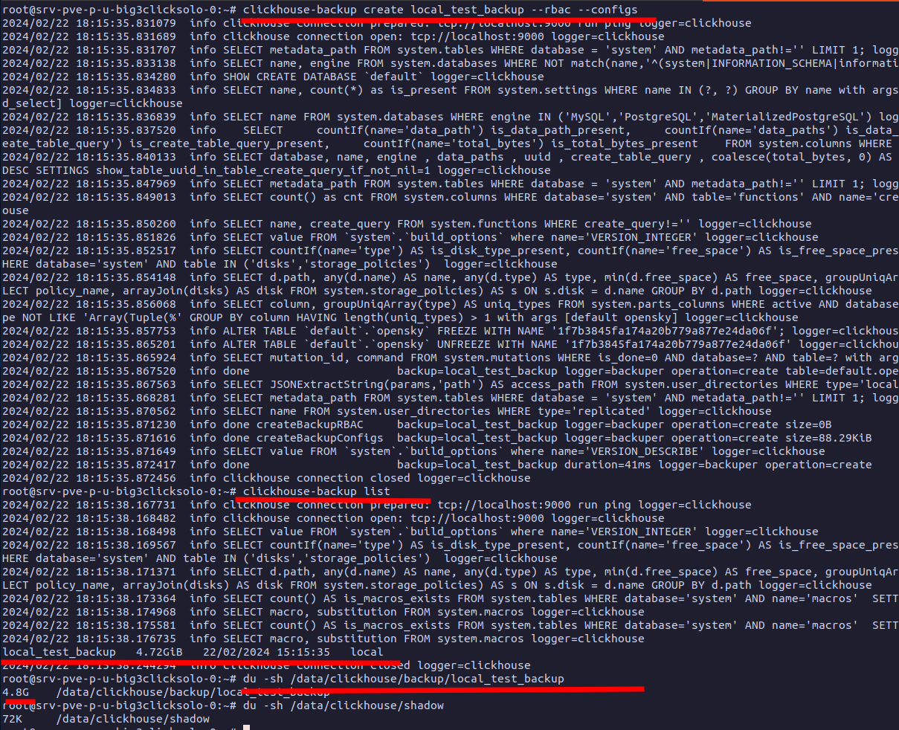

# Cluster. Zookeeper

Clickhouse uses additional service for cluster nodes synchronization of your choice

* ZooKeeper
* ClickhouseKeeper

This service can be deployed as standalone or in another cluster, like Clickhouse itself. So in the end we will have 2 clusters. One for Clickhouse data and one for Clickhouse cluster metadata.

\*Keeper service\cluster is only needed if you use Replication type of tables in Clickhouse. For pure sharding it is not needed.&#x20;

So. Which one to choose?

According to Clickhouse company, their ClickhouseKeeper is better in any way. Simpler, stabler, faster, etc...but. It has the main drawback. It is new and does not have much documentation, track record and community support yet.

Altinity and other seasoned Clickhouse tamers are not yet advise for ClickhouseKeeper as default. So, you could try it, but i will use Zookeeper here. You can convert it to ClickhouseKeeper later.

**Installation**

It is better to start with single Zookeeper server. Not cluster. It is simple to upscale single node to multiply nodes later if you need fail-over property of a cluster.

```bash
apt update && apt install wget -y

#3.8 is the latest supported version by 23.8 lts CH
wget https://dlcdn.apache.org/zookeeper/zookeeper-3.8.3/apache-zookeeper-3.8.3-bin.tar.gz

#Create directory and extract
mkdir /opt/zookeeper && tar -xvf apache-zookeeper-3.8.3-bin.tar.gz  -C /opt/zookeeper --strip-components=1

#Create data, tlogs dirs
mkdir -p /data/zookeeper/data
mkdir -p /data/zookeeper/datalogs

#Create user
useradd zk -m
usermod --shell /bin/bash zk
usermod -aG sudo zk

#Set rights
chown zk:zk /data/zookeeper/data
chown zk:zk /data/zookeeper/datalogs
chown zk:zk -R /opt/zookeeper

#Utils add to bash
echo 'export PATH="/opt/zookeeper/bin:$PATH"' >> /home/zk/.bashrc

#Install JDK 8,11 or 12
apt update && apt install default-jre -y

#Set Heap size at least 3GB
echo 'export _JAVA_OPTIONS=-Xmx3096m' >> /home/zk/.bashrc

```

Check Java

<figure><figcaption></figcaption></figure>

**Settings**

First, create myid file with node number. In single node it is  = 1.

```bash
sudo su zk

echo '1' > /data/zookeeper/data/myid
```

Now paste settings into /opt/zookeeper/conf/zoo.cfg file.&#x20;

```bash
#Enable Web Console
admin.enableServer=true
#Allow to change this config and expand cluster
standaloneEnabled=false
#Allow cluster config with API and CLI
reconfigEnabled=true

#Snapshots(db) files folder
dataDir=/data/zookeeper/data
#Transaction logs
dataLogDir=/data/zookeeper/datalogs
#Dynamic part of this config. With server nodes
dynamicConfigFile=/opt/zookeeper/conf/zoo.cfg.dynamic

#Snapshots to retain
autopurge.snapRetainCount=5
#Snaphots purge interval in hours (more than 5 above)
autopurge.purgeInterval=24
#Enable snapshot compression
snapshot.compression.method=gz

#Cluster follower(observer) sync time in ticks
syncLimit=10
#Ticks lengts in milliseconds
tickTime=2000
#Leader connect to timeout in ticks
initLimit=10
#Enable unlimited attempts to connect to other nodes
electionPortBindRetry=0
#Disable ACL to boost server speed
skipACL=yes

#Enable Prometheus metrics port
metricsProvider.className=org.apache.zookeeper.metrics.prometheus.PrometheusMetricsProvider
metricsProvider.httpPort=7070
```

Now add dynamic node config /opt/zookeeper/conf/zoo.cfg.dynamic

```
server.1=srv-pve-p-u-otuskeeper-0:2888:3888:participant;2181
```

Which means

* server.1 - same number as in myid file
* srv-pve-p-u-otuskeeper-0 - hostname
* 2888:3888  - cluster communication ports
* participant - role of node in cluster
* 2181 - port for client connections (such as Clickhouse Cluster)

Now we should create SystemD service file /etc/systemd/system/zk.service

```ini
[Unit]
Description=Zookeeper Daemon
Documentation=http://zookeeper.apache.org
Requires=network.target
After=network.target

[Service]    
Type=forking
WorkingDirectory=/opt/zookeeper
User=zk
Group=zk
ExecStart=/opt/zookeeper/bin/zkServer.sh start /opt/zookeeper/conf/zoo.cfg
ExecStop=/opt/zookeeper/bin/zkServer.sh stop /opt/zookeeper/conf/zoo.cfg
ExecReload=/opt/zookeeper/bin/zkServer.sh restart /opt/zookeeper/conf/zoo.cfg
TimeoutSec=30
Restart=on-failure

[Install]
WantedBy=default.target
```

Now start the service and check the status

<figure><figcaption></figcaption></figure>

You can now connect with client CLI and check paths in db

<figure><figcaption></figcaption></figure>

