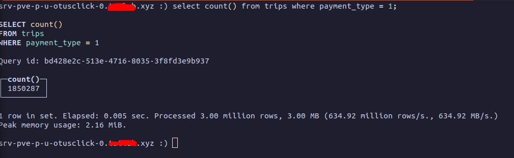
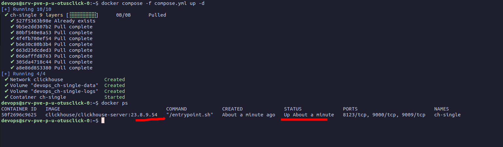

# Installation. Standalone

**Install from Repository.**

Deps and Repo

```bash
#Check if needed CPU features are supported.
grep -q sse4_2 /proc/cpuinfo && echo "SSE 4.2 supported" || echo "SSE 4.2 not supported"

#Install deps
sudo apt-get install -y apt-transport-https ca-certificates dirmngr

#Install keys for Repo
GNUPGHOME=$(mktemp -d)
sudo GNUPGHOME="$GNUPGHOME" gpg --no-default-keyring --keyring /usr/share/keyrings/clickhouse-keyring.gpg --keyserver hkp://keyserver.ubuntu.com:80 --recv-keys 8919F6BD2B48D754
sudo rm -rf "$GNUPGHOME"
sudo chmod +r /usr/share/keyrings/clickhouse-keyring.gpg

#Add repo
echo "deb [signed-by=/usr/share/keyrings/clickhouse-keyring.gpg] https://packages.clickhouse.com/deb stable main" | sudo tee \
    /etc/apt/sources.list.d/clickhouse.list
```

Installation

```bash
#Install from repo (23.8.9.54 is LTS 1-year-support, look into GitHub)
sudo apt-get update && sudo apt-get install -y clickhouse-common-static=23.8.9.54 clickhouse-server=23.8.9.54 clickhouse-client=23.8.9.54

#It will ask for password
```

Check installation


```bash
sudo service clickhouse-server start
clickhouse-client # or "clickhouse-client --password" if you've set up a password.
```


Now let's create test tables

```sql
CREATE TABLE trips (
    trip_id             UInt32,
    pickup_datetime     DateTime,
    dropoff_datetime    DateTime,
    pickup_longitude    Nullable(Float64),
    pickup_latitude     Nullable(Float64),
    dropoff_longitude   Nullable(Float64),
    dropoff_latitude    Nullable(Float64),
    passenger_count     UInt8,
    trip_distance       Float32,
    fare_amount         Float32,
    extra               Float32,
    tip_amount          Float32,
    tolls_amount        Float32,
    total_amount        Float32,
    payment_type        Enum('CSH' = 1, 'CRE' = 2, 'NOC' = 3, 'DIS' = 4, 'UNK' = 5),
    pickup_ntaname      LowCardinality(String),
    dropoff_ntaname     LowCardinality(String)
)
ENGINE = MergeTree
PRIMARY KEY (pickup_datetime, dropoff_datetime);

#Check
show tables;
```

Insert data from S3

```sql
INSERT INTO trips
SELECT
    trip_id,
    pickup_datetime,
    dropoff_datetime,
    pickup_longitude,
    pickup_latitude,
    dropoff_longitude,
    dropoff_latitude,
    passenger_count,
    trip_distance,
    fare_amount,
    extra,
    tip_amount,
    tolls_amount,
    total_amount,
    payment_type,
    pickup_ntaname,
    dropoff_ntaname
FROM s3(
    'https://datasets-documentation.s3.eu-west-3.amazonaws.com/nyc-taxi/trips_{0..2}.gz',
    'TabSeparatedWithNames'
);

#Check
select count() from trips where payment_type = 1
```

You now can see uploaded data.

<figure><figcaption></figcaption></figure>

**Install with Docker.**

The easy way is just to start Docker Compose\Swarm. Be sure Docker is installed.


```bash
nano compose.yml
```


Paste this&#x20;

```yaml
version: '3.9'

services:

  ch-single:
    container_name: ch-single
    hostname: ch-single
    image: clickhouse/clickhouse-server:23.8.9.54
    #Optinal ports to open
    # ports:
    #   - "8123:8123"
    #   - "9000:9000"
    #   - "9009:9009"
    ulimits:
      nproc: 65535
      nofile:
        soft: 262144
        hard: 262144
    #In prod use volumes with static binding to source paths
    volumes:
      - type: volume
        source: ch-single-data
        target: /var/lib/clickhouse
      - type: volume
        source: ch-single-logs
        target: /var/log/clickhouse-server
    networks:
      - clickhouse

networks:
  clickhouse:
    name: "clickhouse"

#Volumes to preserve data
volumes:
  ch-single-data:
  ch-single-logs:
  
```

Now start and test

```bash
docker compose -f compose.yml up -d
docker ps
```

<figure><figcaption></figcaption></figure>

You can login into container and upload test data

```bash
docker exec -it ch-single /bin/bash

clickhouse client
```
