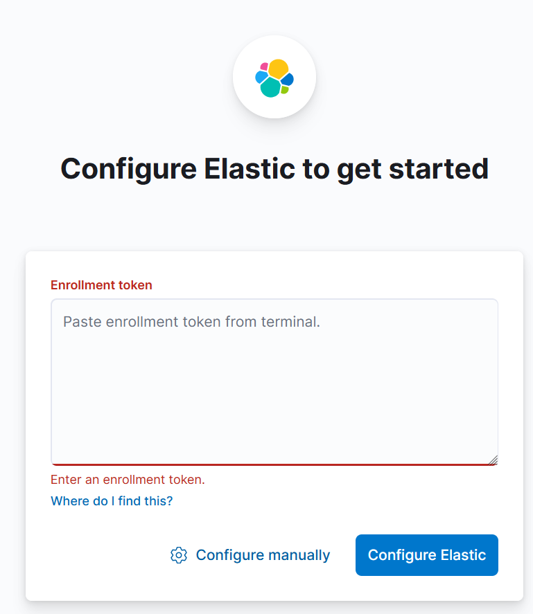

# ELK Stack Setup

Install Java first (ELK is Java based):

```bash
sudo apt install default-jre -y
sudo apt install default-jdk -y
```

Let's add ELK repo:

```bash
curl -fsSL https://artifacts.elastic.co/GPG-KEY-elasticsearch |sudo gpg --dearmor -o /usr/share/keyrings/elastic.gpg
echo "deb [signed-by=/usr/share/keyrings/elastic.gpg] https://artifacts.elastic.co/packages/8.x/apt stable main" | sudo tee -a /etc/apt/sources.list.d/elastic-8.x.list

sudo apt update
```

Now we should install Elasticsearch:

```bash
sudo apt install elasticsearch -y
```

We will get notification with generated settings, copy generated **elastic** user password (it is '**Passssssssswrd**' here):

```bash
--------------------------- Security autoconfiguration information ------------------------------

Authentication and authorization are enabled.
TLS for the transport and HTTP layers is enabled and configured.

The generated password for the elastic built-in superuser is : Passssssssswrd

If this node should join an existing cluster, you can reconfigure this with
'/usr/share/elasticsearch/bin/elasticsearch-reconfigure-node --enrollment-token <token-here>'
after creating an enrollment token on your existing cluster.

You can complete the following actions at any time:

Reset the password of the elastic built-in superuser with 
'/usr/share/elasticsearch/bin/elasticsearch-reset-password -u elastic'.

Generate an enrollment token for Kibana instances with 
'/usr/share/elasticsearch/bin/elasticsearch-create-enrollment-token -s kibana'.

Generate an enrollment token for Elasticsearch nodes with 
'/usr/share/elasticsearch/bin/elasticsearch-create-enrollment-token -s node'.

-------------------------------------------------------------------------------------------------
### NOT starting on installation, please execute the following statements to configure elasticsearch service to start automatically using systemd
 sudo systemctl daemon-reload
 sudo systemctl enable elasticsearch.service
### You can start elasticsearch service by executing
 sudo systemctl start elasticsearch.service
Scanning processes...                                                                                                                                                                                                                                                                     
Scanning linux images...                                                                                                                                                                                                                                                                  

Running kernel seems to be up-to-date.

No services need to be restarted.

No containers need to be restarted.

No user sessions are running outdated binaries.

No VM guests are running outdated hypervisor (qemu) binaries on this host.
```

Now start Elasticsearch and enable daemon:

```bash
sudo systemctl enable elasticsearch.service
sudo systemctl start elasticsearch.service
```

Install Kibana UI:

```bash
sudo apt install kibana -y
#enable remote access
sudo sed -i 's/#server.host: "localhost"/server.host: 0.0.0.0/g' /etc/kibana/kibana.yml
#start and enable daemon
sudo systemctl enable kibana
sudo systemctl start kibana
```

Now you should be able to load Kibana UI:

<figure><figcaption></figcaption></figure>

To get this token you should generate it with:

```bash
sudo su -
cd /usr/share/elasticsearch/bin/
./elasticsearch-create-enrollment-token -s kibana
```

Copy this token into Kibana UI above, press **Configure Elastic** and you will get code request:

<figure><figcaption></figcaption></figure>

Go back to your terminal and get this code from Kibana logs:

```bash
cd /usr/share/kibana
./bin/kibana-verification-code
Your verification code is:  795 777
```

When configuration in UI is finished it will ask for user and password:

<figure><figcaption></figcaption></figure>

Use generated **elastic** user and password ('**Passssssssswrd**'). That's it. Elastic and Kibana are done. Next is Elastic Agent.

<figure><figcaption></figcaption></figure>

