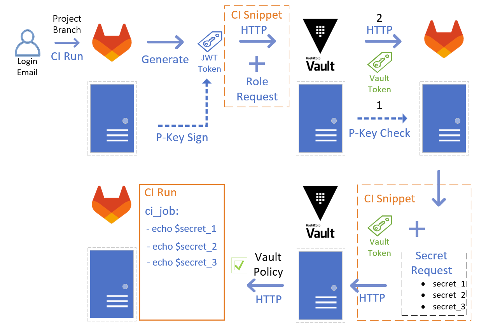
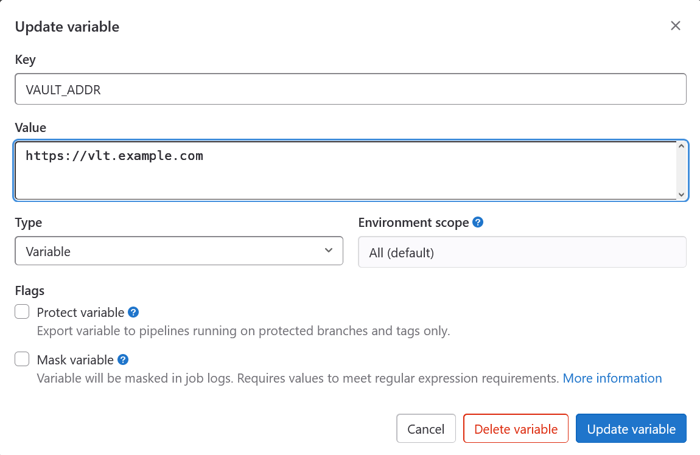

# GitLab CI Integration

#### Intro

You can use Vault as secrets store for GitLab CI variables. JWT token is used to achieve this.

Using Vault as a secrets store gives you granular GitLab CI variables rights control.

Next pic shows how the secret retrieval to CI process works:

<figure><figcaption></figcaption></figure>

1. The User starts GitLab CI.
2. GitLab gathers User metadata. Login, email, running branch, etc.
3. GitLab packs this metadata into base64 JWT token.
4. GitLab signs JWT token with GitLab hidden private key. Now we have signed base64 text with User metadata (JWT token).
5. You can use GitLab CI job command to request from Vault API a secret using this JWT token and Vault Role name (manually created in Vault). Or use a custom bash script in GitLab job to do the same.
6. When Vault receives a request for secret it checks JWT signature from configured GitLab server address.
7. Vault reads JWT metadata, and checks rights for this metadata and role (policy). Gives back a new Vault token with corresponding rights for secrets.
8. Using this Vault token GitLab reads a secret from Vault store into CI shell.

Example of decoded JWT token for GitLab User gitlabuserloginone:

```json
{
  "jti": "c82eeb0c-5c6f-4a33-abf5-5234dsfgsf345",
  "iss": "gitlabserver.example.com",
  "iat": 1585710286,
  "nbf": 1585798372,
  "exp": 1585713886,
  "sub": "job_1212",
  "namespace_id": "1",
  "namespace_path": "mygroup",
  "project_id": "6969",
  "project_path": "mygroup/myproject",
  "user_id": "42",
  "user_login": "gitlabuserloginone",
  "user_email": "gitlabuserloginone@example.com",
  "pipeline_id": "1212",
  "pipeline_source": "web",
  "job_id": "1212",
  "ref": "main",
  "ref_type": "branch",
  "ref_protected": "true",
  "environment": "production",
  "environment_protected": "true"
}
```

#### Setup

Activate JWT auth support in Vault node and add GitLab server (NOT GitLab Runner) connection:

```bash
#enable 
vault auth enable jwt

#add server
vault write auth/jwt/config \
    bound_issuer="gitlabserver.example.com" \
    jwks_url="http://gitlabserver.example.com/-/jwks"

#check
vault read auth/jwt/config
```

Create a role for GitLab repository CI:

```bash
#create role
vault write auth/jwt/role/gitlabuserloginone - <<ROLE
{
"role_type": "jwt",
"policies": ["gitlabuserloginone"],
"token_explicit_max_ttl": 60,
"user_claim": "user_email",
"bound_claims": {
"user_login": "gitlabuserloginone",
"ref": ["main","master"],
"ref_type": "branch",
"project_id": "6969"
}
}
ROLE

#check
vault list auth/jwt/role
vault read auth/jwt/role/gitlabuserloginone
```

Create an access policy for the role above. This example is an access policy with a random name (gitlabuserloginone) with rights to read Vault secrets on the specified path (with project number for usage in scripting):

```bash
vault policy write gitlabuserloginone - <<POLICY
path "gitlabsecrets/data/6969" {
capabilities = ["read", "list"]
}
POLICY
```

This role and policy allow for gitlabuserloginone from CI of project 6969 and main or master branch to access secrets in Vault path gitlabsecrets/6969 ("data" is not shown in UI of KV v2).

#### GitLab CI Scripts

First, define Vault server address in GitLab Variable VAULT\_ADDR:

<figure><figcaption></figcaption></figure>

Next we can use this snippet in Gitlab CI to get (for free! no premium GitLab needed) secrets into running CI shell:

```yaml
.vault_secret:
  get:
    #generate variable Payload with JWT token and Role name
    - |-
      PAYLOAD=$(cat << JSON
      {
        "jwt": "${CI_JOB_JWT}",
        "role": "role-${GITLAB_USER_LOGIN}"
      }
      JSON
      )
    #send PAYLOAD with curl to Vault API and get a response into VAULT_TOKEN variable
    - >
      export VAULT_TOKEN="$(curl -ss -X POST ${VAULT_ADDR}/v1/auth/jwt/login
      --header 'Content-Type: application/json; charset=utf-8'
      --data-binary "$PAYLOAD" 
      | jq -r .auth.client_token )"
    #set counter variable EMPTY_STATUS to control wrong requests with empty responses
    - >
      EMPTY_STATUS=0
    #using VAULT_TOKEN get secrets from Vault API path ${VAULT_ADDR}/v1/gitlabsecrets/data/${CI_PROJECT_ID} into GitLab CI shell
    - >
      while read cmd; do [ -z "$cmd" ] && EMPTY_STATUS=$((EMPTY_STATUS+1)) || export $cmd; done 
      <<<$(
      curl -ss -H "X-Vault-Token:$VAULT_TOKEN" ${VAULT_ADDR}/v1/gitlabsecrets/data/${CI_PROJECT_ID} | 
      jq -r '.data.data | with_entries(select(.value | . !=null and . != "")) | to_entries | .[] | .key + "=" + .value'
      )
    #(optional) do the same for path with environment
    - >
      while read cmd; do [ -z "$cmd" ] && EMPTY_STATUS=$((EMPTY_STATUS+1)) || export $cmd; done 
      <<<$(
      curl -ss -H "X-Vault-Token:$VAULT_TOKEN" ${VAULT_ADDR}/v1/gitlabsecrets/data/${CI_PROJECT_ID}/${CI_ENVIRONMENT_NAME} | 
      jq -r '.data.data | with_entries(select(.value | . !=null and . != "")) | to_entries | .[] | .key + "=" + .value'
      )
    #print error and stop CI if no secrets were retrieved.
    - > 
      if [ "$EMPTY_STATUS" -eq 2 ]; then { echo "Some Vault variables not set or login name is wrong!"; exit 1; }; fi
```

To use this script we must run our gitlab job inside container runner (or inside shell runner) with curl, jq available:

```yaml
gitlab_job:
  stage: deploy
  image:
    name: "gitlabserver.example.com:5050/images/k8s-utils:latest"
    entrypoint: [""]
  before_script:
    - !reference [.vault_secret, get]
  script:
    - echo $VAULT_SECRET
  tags:
    - dockerrunner
    
```

In this example k8s-utils:latest is the custom-build docker image with curl, jq, and other utils.
