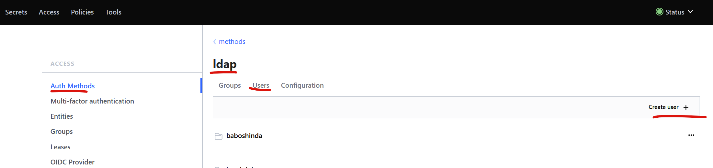
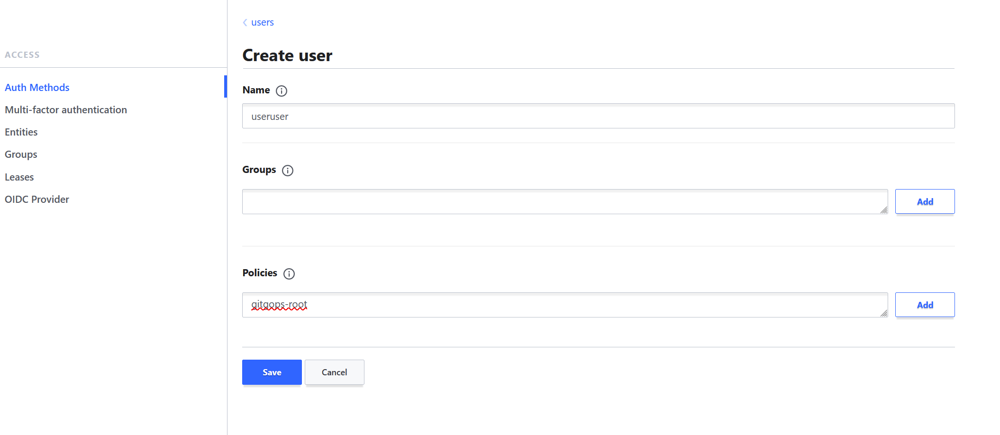
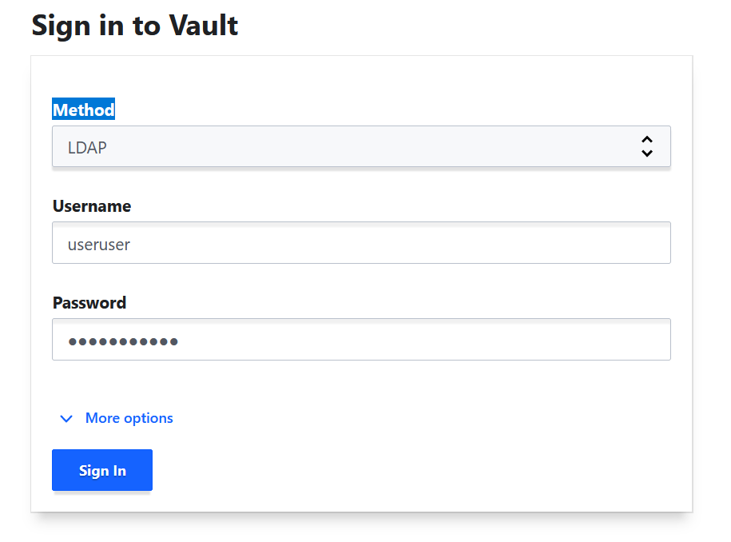

# Active Directory Integration

Active Directory accounts can be used to authenticate in Vault UI and CLI. To do so we need to create a connection config, create user\group and attach\create access policy.

<pre class="language-bash"><code class="lang-bash">#enable ldap auth
vault auth enable ldap

#write ldap connection config
vault write auth/ldap/config \
<strong>binddn="CN=VaultSvc,OU=VaultOU,DC=ad,DC=example,DC=com" \
</strong>bindpass="VaultSvcPassword" \
url="ldap://srv-hv-dcone.example.com" \
userattr="samaccountname" \
userdn="DC=example,DC=com" \
groupdn="DC=example,DC=com"
</code></pre>

Another way is API request with JSON:

```json
{
    "anonymous_group_search": false,
    "case_sensitive_names": false,
    "certificate": "",
    "deny_null_bind": true,
    "discoverdn": false,
    "groupattr": "cn",
    "groupdn": "DC=example,DC=com",
    "groupfilter": "(|(memberUid={{.Username}})(member={{.UserDN}})(uniqueMember={{.UserDN}}))",
    "insecure_tls": false,
    "request_timeout": 120,
    "starttls": false,
    "tls_max_version": "tls12",
    "tls_min_version": "tls12",
    "upndomain": "",
    "use_pre111_group_cn_behavior": false,
    "use_token_groups": false,
    "userattr": "samaccountname",
    "userdn": "DC=example,DC=com",
    "binddn": "CN=VaultSvc,OU=VaultOU,DC=ad,DC=example,DC=com",
    "bindpass": "VaultSvcPassword",
    "userfilter": "({{.UserAttr}}={{.Username}})",
    "username_as_alias": false
  }
```

In this example, **binddn** and **bindpass** are credentials of AD User for LDAP search.&#x20;

BTW, in GitOps way you can use this JSON to get the password and user for LDAP search directly from Vault itself, using [GitLab CI Integration](gitlab-integration.md). This is GitLab Job Example:

```yaml
update_ldap_config:
  stage: gitops_settings
  image: "gitlab-registry.example.com/home-lab/infra/vault:k8s-utils"
  script:
    #GitLab Snippet to get secret from Vault
    - !reference [.vault_root_secret, get]
    #read json file with LDAP settings and apply with Vault CLI
    - >
      cat ./vault-settings/admin/config/ldap.json | vault write auth/ldap/config - ; 
      vault write auth/ldap/config binddn="${ldap_lookup_dn}" bindpass="${ldap_lookup_pass}" url="${ldap_lookup_url}"
  tags:
    - dockerrunner

```

Next, we will add Ldap user we want to give Vault access for and a policy in UI (can be done in CLI\JSON too).

<figure><figcaption></figcaption></figure>

You should type exact LDAP login name from AD

<figure><figcaption></figcaption></figure>

In this example, we also typed in the existing Vault policy "**gitops-root**". Policy **gitops-root** is manually created beforehand, and also can be any other policy. This time we added a policy with root rights, so **useruser** will have any rights to config Vault after LDAP login.

<figure><figcaption></figcaption></figure>

That's it. Now you can log in into Vault UI\CLI with user name **useruser.** VaultSvc account is connection account to look for **useruser.**
